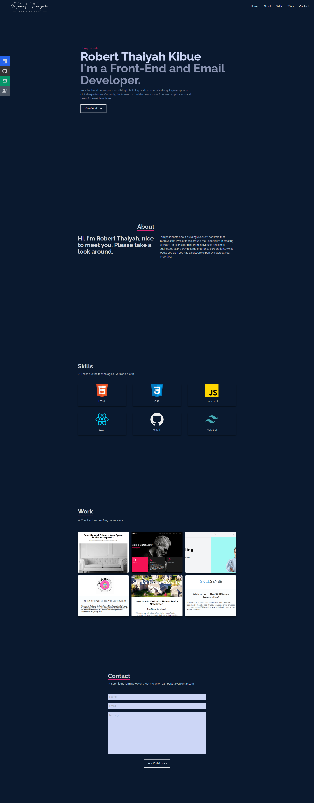

# Personal Portfolio Project

## Table of contents

- [Overview](#overview)
  - [Screenshot](#screenshot)
  - [Links](#links)
- [My process](#my-process)
  - [Built with](#built-with)
  - [Continued development](#continued-development)
- [Author](#author)

## Overview

This is my personal portfolio created using HTML, TailwindCSS and Javascript. The project is a simple one and will take very many iterations as I
continue to learn new technologies.

### Screenshot

### Links

- Solution URL: [Github Repo](https://github.com/Robert-Thaiyah/react-portfolio)
- Live Site URL: [Livesite URL]()

## My process

- First I sought some samples from Dribbble but decided on using a simple approach on my profile, having only the skills, portfolio and contact pages.
- Then I built a shell using React and Tailwind.

### Built with

- Semantic HTML5 markup
- Flexbox
- CSS Grid
- Tailwind CSS
- React

### Continued development

- Create more projects to polish up tailwind and HTML.

## Author

- Website - [Git Profile](https://github.com/Robert-Thaiyah)

